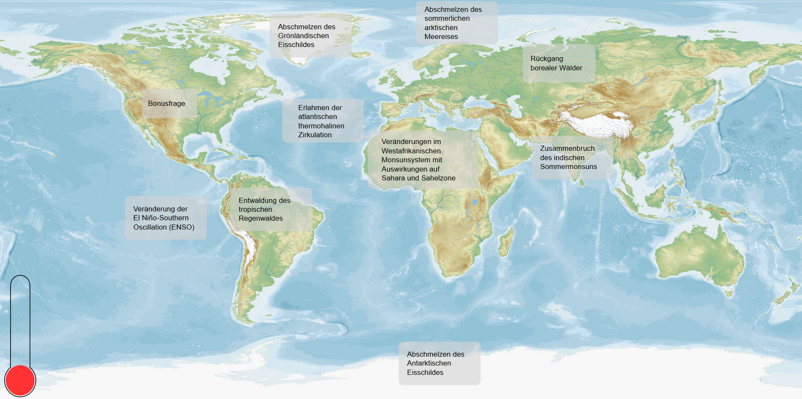

# climate-quiz
This game was developed during a four day Project Management course in which our team was tasked to develop a small game according to the customers wishes.

The Project was planned using different project planning techniques for time and risk management.

## Requirements:
* The game should be fun and educational
* It should be themed around the tipping points in the climate system
* The game should be accessible and playable on multiple operating systems

## Description:
The game is a small quiz about the different tipping points in our climate system. Different tipping points can be selected on a world map, according to their geographic location. 
For each tipping point there are currently three questions available. At the end of each tipping point section the game displays the statistics for the current quiz and educational links, which allow the player to get more information about the selected tipping point.  The game is played with a timer currently set to 15 minutes, which is represented by a thermometer displaying the current global warming level. 
Additionally each wrongly answered question decreases the time available. If the thermometer fills up it's game over.

## Screenshot:
Screenshot showing the main screen of the game

## Attribution:
Background "Blank Equirectangular Physical Map of the World" by [mapswire.com](https://mapswire.com/world/physical-maps/), licensed under CC BY 4.0.
